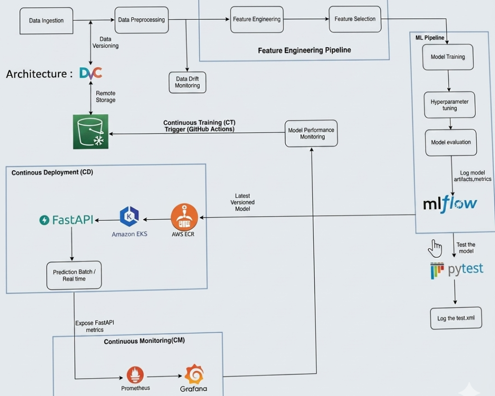

# Enterprise MLOps Architecture & Deployment Lifecycle

[](https://github.com/Raghunath2604/MLops-LifeCycle/actions/workflows/main.yml)
[](https://www.python.org/)
[](https://kubernetes.io/)
[](https://mlflow.org/)
[](https://fastapi.tiangolo.com/)

A production-grade, self-healing, cloud-native machine learning ecosystem. This repository demonstrates a mature MLOps Level 4 architecture, covering the entire software lifecycle: **Continuous Integration (CI)**, **Continuous Deployment (CD)**, **Continuous Testing (CT)**, and **Continuous Monitoring (CM)**.

*"Building a model is data science. Engineering a reliable, observable, and automated infrastructure around that model is MLOps."*

---

## 🚀 The 6-Phase Architectural Roadmap

1. **Data & Model Lineage** ── Integrated **DVC** to version-track raw data and **MLflow** for model binaries, ensuring absolute experiment reproducibility on **AWS S3**.
2. **High-Performance Serving** ── Wrapped the XGBoost model logic inside an asynchronous **FastAPI** web service, optimized with a **Redis** caching layer for ultra-low latency (`<1ms`) production inference.
3. **Continuous Training & Testing (CT)** ── Configured **GitHub Actions** to automatically pull remote data, retrain the ML pipeline, log new artifacts to MLflow, and execute **Pytest** validation on every code change.
4. **Continuous Integration & Deployment (CI/CD)** ── Automated the packaging of optimized **Docker** containers, shipping them to **Amazon ECR**, and orchestrating declarative Kubernetes manifests to deploy pods to an **Amazon EKS** cluster with zero-downtime rolling updates.
5. **The Observability Loop (CM)** ── Instrumented the FastAPI application to expose telemetry metrics to **Prometheus**, visualizing live API request traffic, latency, and cluster health via custom **Grafana** dashboards.
6. **Proactive Drift Monitoring** ── Deployed a continuous evaluation dashboard via **Streamlit** using **Evidently AI** to automatically catch data drift and concept drift before they impact production accuracy.

---

## 🗺️ System Architecture



---

## 🛠️ Technology Stack

| Category | Technologies |
|---|---|
| **Machine Learning** | XGBoost, Scikit-Learn, Pandas, NumPy |
| **Model Serving** | FastAPI, Uvicorn, Gunicorn |
| **Caching Layer** | Redis |
| **Experiment Tracking** | MLflow, DVC (Data Version Control) |
| **Infrastructure & Cloud** | AWS EKS, AWS ECR, AWS S3 |
| **Containerization & Orchestration**| Docker, Kubernetes, NGINX Ingress |
| **CI/CD & Automation** | GitHub Actions, Pytest |
| **Observability & Monitoring** | Prometheus, Grafana, Evidently AI, Streamlit |

---

## 📂 Project Structure

```text
├── .github/workflows/       # GitHub Actions CI/CD/CT pipelines
├── drift_monitoring/        # Evidently AI & Streamlit dashboard apps
├── prediction_model/        # Core XGBoost training & prediction logic
├── tests/                   # Pytest suite for model & API validation
├── main.py                  # FastAPI application entry point
├── Dockerfile               # Containerization blueprint
├── deployment.yml           # Kubernetes deployment manifest for FastAPI
├── service.yml              # Kubernetes service manifest for load balancing
├── service-monitor.yml      # Prometheus ServiceMonitor configuration
├── requirements.txt         # Python dependencies
└── README.md                # Project documentation
```

---

## ⚙️ Quick Start Guide

### 1. Prerequisites
Ensure you have the following installed on your local machine:
- Python 3.9+
- Docker
- AWS CLI (configured with appropriate IAM permissions)
- `kubectl`
- Git & DVC

### 2. Local Environment Setup
Clone the repository and set up your virtual environment:
```bash
git clone https://github.com/Raghunath2604/MLops-LifeCycle.git
cd MLops-LifeCycle

# Create and activate virtual environment
python -m venv venv
source venv/bin/activate  # On Windows: venv\Scripts\activate

# Install dependencies
pip install -r requirements.txt
```

### 3. Data & Model Pipeline
Pull the versioned data from AWS S3 and train the model locally:
```bash
# Pull data artifacts
dvc pull

# Execute the training pipeline (logs to MLflow)
python prediction_model/training_pipeline.py
```

### 4. Running the API Locally
Start the FastAPI server:
```bash
uvicorn main:app --host 0.0.0.0 --port 8005 --reload
```
Access the interactive API documentation at `http://localhost:8005/docs`.

---

## 🚢 Production Deployment

The entire infrastructure is automated via **GitHub Actions**. Upon pushing to the `main` branch, the pipeline will:
1. Pull the latest DVC datasets.
2. Train the model and log to the remote MLflow server.
3. Run the Pytest suite.
4. Build and push the Docker image to AWS ECR.
5. Deploy the updated containers to the AWS EKS cluster.

To manually configure or update the Kubernetes cluster locally:
```bash
# Connect to the EKS cluster
aws eks update-kubeconfig --region us-east-2 --name mlops-v3

# Apply Kubernetes manifests
kubectl apply -f deployment.yml
kubectl apply -f service.yml
kubectl apply -f service-monitor.yml
```

---

## 📊 Dashboard Showcases

### Data Drift & Quality Checks (Evidently AI)


### API Traffic & Cluster Health (Prometheus + Grafana)


