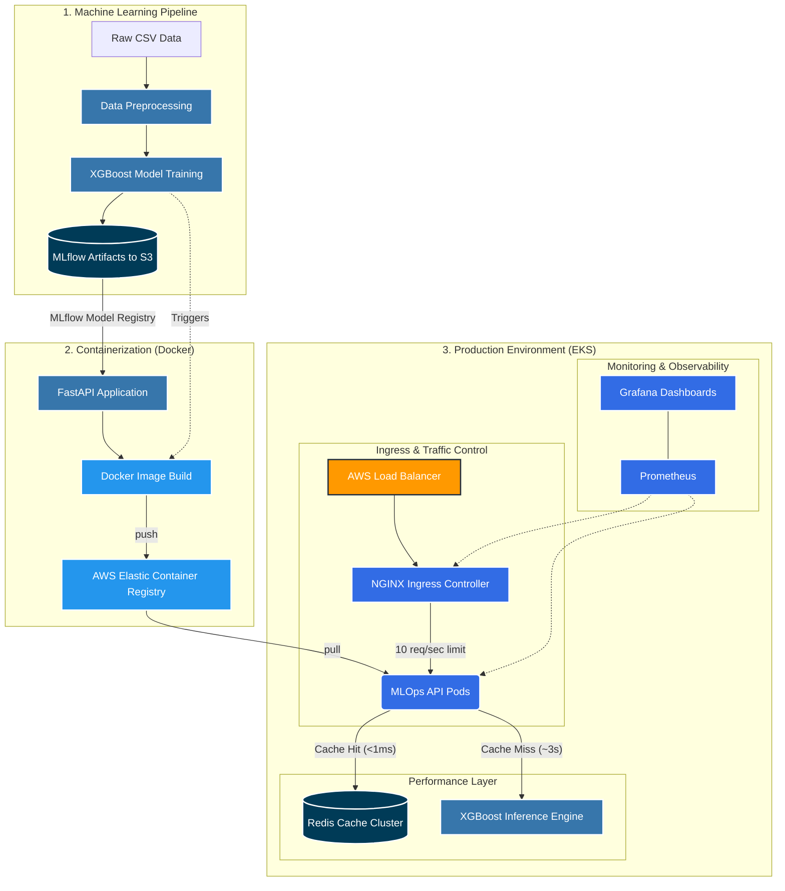

# Enterprise MLOps Architecture

[](https://github.com/Raghunath2604/MLops-LifeCycle/actions/workflows/main.yml)
[](https://www.python.org/)
[](https://kubernetes.io/)

A complete, self-healing, cloud-native ecosystem that covers the entire software lifecycle: Continuous Integration (CI), Continuous Deployment (CD), Continuous Testing (CT), and Continuous Monitoring (CM).

*"Building a model is data science. Engineering a reliable, observable infrastructure around that model is MLOps."*

## 🚀 The 6-Phase Architectural Roadmap

1. **Data & Model Lineage** ── Integrated **DVC** to version-track raw data and **MLflow** for model binaries, ensuring absolute experiment reproducibility on AWS S3.
2. **High-Performance Serving** ── Wrapped the XGBoost model logic inside an asynchronous **FastAPI** web service, optimized with a **Redis** caching layer for `<1ms` production inference.
3. **Automated CI/CD Workflows** ── Configured **GitHub Actions** pipelines to trigger automated unit testing via **Pytest**, build optimized Docker containers, and ship them to **Amazon ECR** on every code change.
4. **Cloud-Native Orchestration** ── Authored declarative Kubernetes manifests to deploy pods to an **Amazon EKS** cluster, managing horizontal auto-scaling, routing, and zero-downtime availability.
5. **The Observability Loop** ── Instrumented the application to expose telemetry metrics to **Prometheus**, visualizing live API request traffic and cluster health via custom **Grafana** dashboards.
6. **Proactive Drift Monitoring** ── Deployed a continuous evaluation dashboard via **Streamlit** using **Evidently AI** to automatically catch data drift and target drift before they impact production accuracy.

---

## 🗺️ System Architecture



---

## 📊 Dashboard Showcases

### Data Drift & Quality Checks (Evidently AI)


### API Traffic & Cluster Health (Prometheus + Grafana)


---

## 🛠️ Quick Start Guide

### Local Development
To run the model training pipeline locally:
```bash
pip install -r requirements.txt
dvc pull
python prediction_model/training_pipeline.py
```

To run the FastAPI server locally:
```bash
uvicorn main:app --host 0.0.0.0 --port 8005 --reload
```

### Production Deployment
The infrastructure is deployed automatically via GitHub Actions upon pushing to the `main` branch. To manually deploy or update the Kubernetes cluster:
```bash
aws eks update-kubeconfig --name mlops-v3
kubectl apply -f deployment.yml
kubectl apply -f service.yml
kubectl apply -f service-monitor.yml
```
